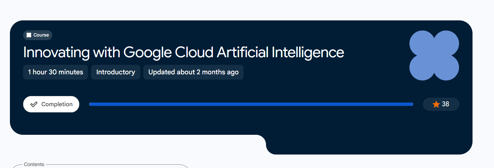

# ☁️ Google Cloud AI Learning & Certifications

This repository documents my training, practical knowledge, and achievements on the **Google Cloud Skills Boost** platform as I advance my skills in Artificial Intelligence and Machine Learning.

---

## 🏅 Completed Course & Badge

### 1. Innovating with Google Cloud Artificial Intelligence
- **Platform:** Google Cloud Skills Boost
- **Focus Area:** Generative AI, Machine Learning Infrastructure, and Data Analytics Solutions.

#### 💡 Key Skills & Concepts Acquired:
- **Generative AI & Agentic AI:** Understanding foundation models, prompt engineering, and autonomous agent systems.
- **BigQuery ML:** Building and executing predictive machine learning models directly using standard SQL queries.
- **Pre-trained AI APIs:** Utilizing Google Cloud's Vision API, Speech-to-Text API, and Natural Language API for real-world automation tasks.
- **Custom Models & AutoML:** Training specialized computer vision and classification models without deep manual coding.
- **Explainable AI (XAI) & Cost Optimization:** Implementing model interpretability and optimizing cloud compute costs using Spot VMs and Dynamic Workload Schedulers.

---

## 🖼️ Proof of Completion

🔗 **Verify My Badge on Google Cloud:** [My Public Profile]( https://www.skills.google/public_profiles/d14e4c6e-98c7-49df-9c82-e6745bc3cf92)

---

## 🛠️ Tech Stack & Skills
`Python` | `Machine Learning` | `Google Cloud Platform` | `BigQuery SQL` | `Generative AI`
